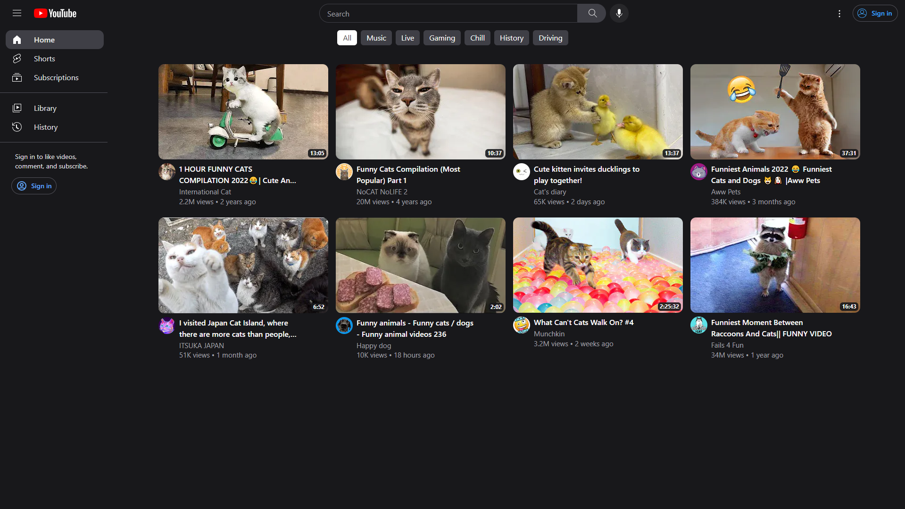

# [Youtube Ui](https://nextjs13-2-youtubue-ui.vercel.app/)

[](https://nextjs13-2-youtubue-ui.vercel.app/)


## Description

My goal for this app was to create a front-end copy of the YouTube application. I was trying to achieve not only the same look but also to re-create the behavior of the website and its individual components. It was my first time using Next.js with the App Router which was still in beta at that moment. The App Router functionality changes a lot and I wanted to learn it and understand it as soon as possible. Of course this is just  a copy of a few elements that I wanted to recreate. This project is not complete, however, it was a valuable learning experience on recreating an existing application using a tech stack that I was interested in. 

An interesting thing about this project was that I created a number of YouTube features and components using Tailwind only. From the curiosity of my job about this project I can say that I was able to recreate a lot of things really well using only basic Tailwind. Which isn't that obvious because I'm pretty sure youtube is not using Tailwind in their code, at least not yet.


## Tech Stack

- [Next.js](https://nextjs.org)
- [Tailwind CSS](https://tailwindcss.com)
- [Zustand](https://zustand-demo.pmnd.rs/)
- [Headlessui](https://headlessui.com/)


## Installation

### 1. Clone the repository


```bash
git clone https://github.com/ilisiecki/nextjs13.2-youtubue-ui.git
``

### 2. Install dependencies


```bash
npm install
```

### 3. Run the application


```bash
npm run dev
```

### 4. View the application

Open [http://localhost:3000](http://localhost:3000) with your browser to see the result.


## Deploy on Vercel

The easiest way to deploy your Next.js app is to use the [Vercel Platform](https://vercel.com/new?utm_medium=default-template&filter=next.js&utm_source=create-next-app&utm_campaign=create-next-app-readme) from the creators of Next.js.

Check out our [Next.js deployment documentation](https://nextjs.org/docs/deployment) for more details.
